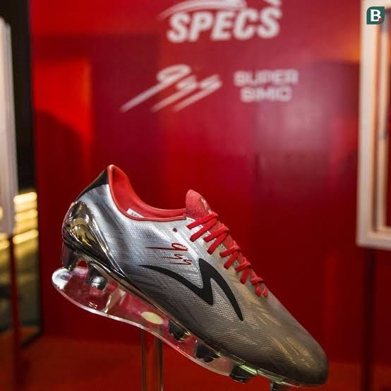
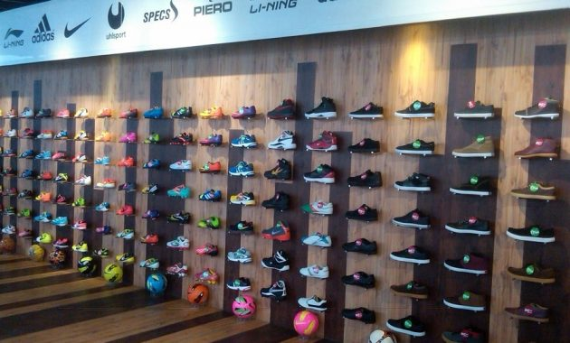
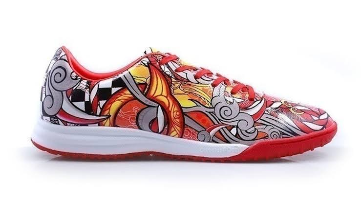
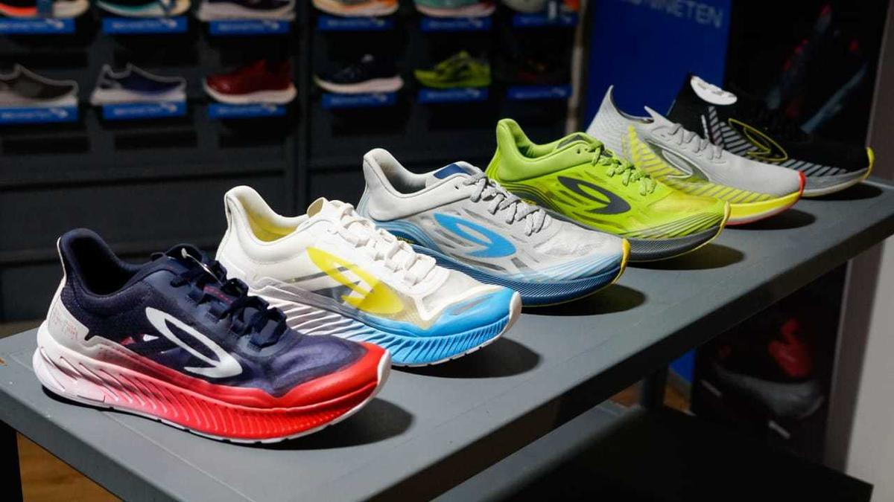
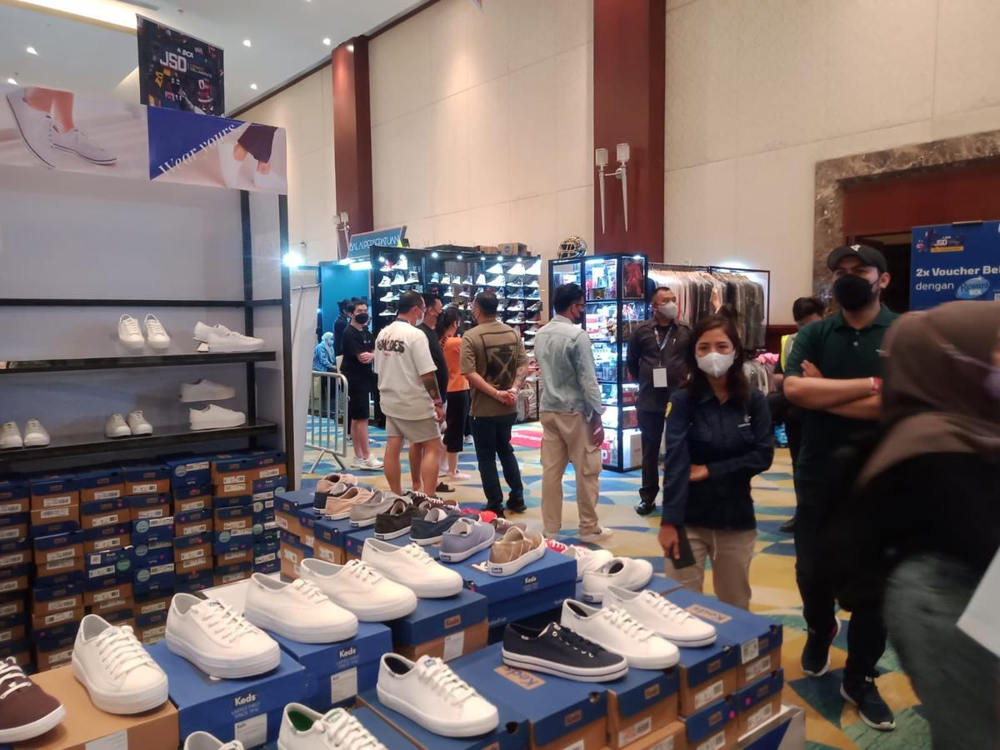
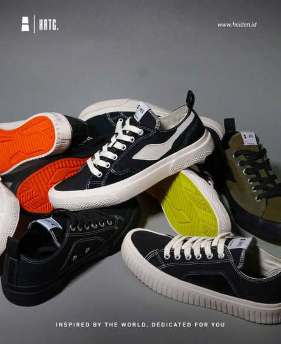

<!DOCTYPE html>
<html lang="en">

<head>
    <meta charset="UTF-8">
    <meta http-equiv="X-UA-Compatible" content="IE=edge">
    <meta name="viewport" content="width=device-width, initial-scale=1.0">
    <title>Uts SIM</title>
    <link rel="preconnect" href="https://fonts.gstatic.com">
    <link href="https://fonts.googleapis.com/css2?family=Inter&display=swap" rel="stylesheet">

    <link rel="stylesheet" href="style.css">
</head>

<body>
    <nav class="navbar">
        <h1>Uts SIM Vishal</h1>
        

            
Home

            
Articles

            
            
            
        

    </nav>
    <section class="hero-container">
        

            

                <h1>Makin pede dengan sepatu kece
                </h1>
                
why learn how to blog?

            

        

        
    </section>
    <section class="description-container">
        

            

                <h2> Grosir sepatu murah & kece berkualitas</h2>
                
Distributor - grosir sepatu murah & kece berkualitas Tempat kulakan sandal dan sepatu sekolah, sneakers, loafers, boots safety, pantofel, wedges, slip on, heels, flat shoes dll. Jika anda adalah reseller, punya usaha toko fashion pasti cari supplier sepatu, sandal, kaus kaki dan aksesoris sepatu termurah. Namanya juga bisnis, wajar cari pemasok barang berkualitas dengan harga paling murah biar bisa untung banyak jika dijual kembali. Itu merupakan tips strategi paling jitu dalam dunia perdagangan
                

            

                
Nov 11th 2022

                
Read more

            

        

        
    </section>
    <section class="content-container">
        

            
            

                <h3>Apa keunggulan sepatu kami?</h3>
                
Sepatu ultra boost buatan kami memiliki kelebihan lebih dibandingkan dengan sepatu lainnya, berikut beberapa keunggulan sepatu dari Adidas keluaran terbaru dengan teknologi ultra boost:
                    Sol Lebih Kuat dan Ringan. ...  
                    2. Jahitan Kuat, Nyaman di Kulit. ...  
                    3. Lebih Nyaman Digunakan. ... 
                    4. Cocok untuk Aktivitas Outdoor.             

            

                
Nov 11th 2022

                
Read more

            

        

        

            
            

                <h3>Menyediakan Brand Sepatu Sneakers Lokal Terbaik</h3>
                
NAH Project. Sepatu merk NAH Project mulai viral dan dikenal khalayak umum ketika digunakan oleh Jokowi, Presiden Republik Indonesia (RI). ...  
                    2. Compass. ...  
                    3. Geoff Max Footwear. ...  
                    4. Saint Barkley. ...  
                    Thanksinsomnia. ...  
                    6. Piero. ...  
                    7. Wakai. ...  
                    Brodo..            

            

                
Nov 11th 2022

                
Read more

            

        

        

            
            

                <h3>Apa yang menjadi daya tarik sepatu lokal?</h3>
                
Sepatu lokal dikenal memiliki harga yang lebih terjangkau dibandingkan produk ternama dari luar. Banyaknya merek lokal yang muncul membuat persaingan makin ketat, apalagi setiap merek memiliki kekhasan masing-masing. Tak hanya kualitas, desain sepatu lokal juga makin bervariasi dan tidak kalah dengan produk luar negeri.
                

            

                
Nov 11th 2022

                
Read more

            

        

    </section>
    <section class="what-is-container">
        

            

                <h1>Brand lokal semakin mendunia?</h1>
                
Manfaat Berolahraga adalah Menormalkan kadar kolesterol di dalam tubuh. Membakar kalori di dalam tubuh. Menyehatkan jantung. Mencegah terjadinya obesitas.

                    Keunggulan sepatu specs
                    Kualitas bagus
                    Ketika berbicara mengenai olahraga yang menuntut banyak kekuatan fisik seperti sepakbola maka salah satu hal terpenting adalah dengan memiliki perlengkapan yang memadai dan berkualitas agar tidak mengganggu fungsi kerja tubuh.
                    
                    Harga terjangkau dan bobot ringan
                    sepatu bola specs
                    
                    Biasanya bila sepatu sepakbola yang kualitasnya sudah teruji baik ditambah dengan desain menarik maka dapat dikatakan harga sepatu itu akan menguras kantong untuk hanya bisa memiliki satu pasang saja.
                    
                    Keunggulan sepatu futsal Ortuseight
                    
                    Quick Fit adalah material pelapis di bagian dalam upper sepatu. Material ini memiliki tekstur yang lembut dan dapat mengikuti bentuk kaki penggunanya. Ort-strap merupakan teknologi yang memiliki fungsi untuk memeluk dan melindungi kaki penggunanya.
                                    

            

            

                
Nov 11th 2022

                
Read more

            

        

        
    </section>
    <section class="button-container">
        <button class="btn">See More Now</button>
    </section>
    <footer>
        
<b>Grosirsepatulocalpride</b> 2022 copyright all rights reserved

        

            
            
            
        

    </footer>

</body>

</html>
